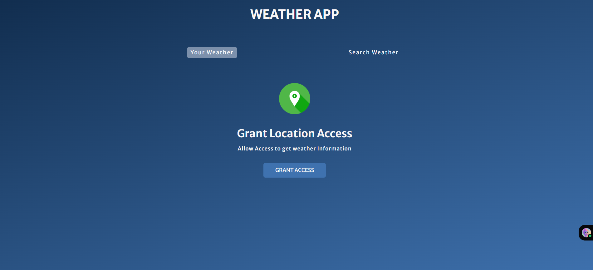
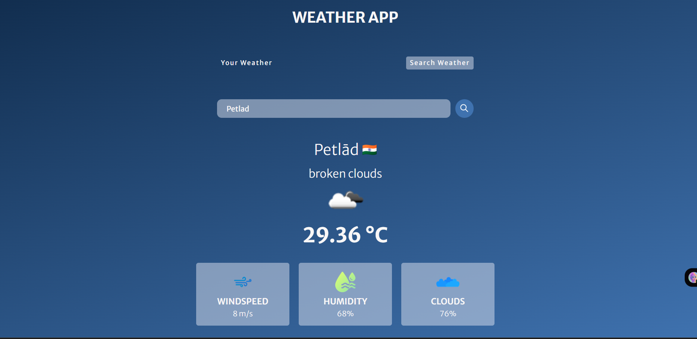
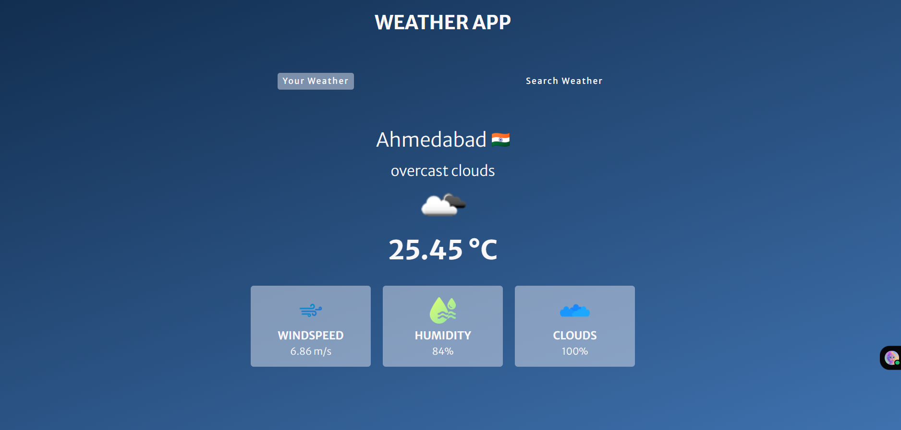

# weather-app
A simple Weather App that fetches real-time weather data using an API and displays temperature, humidity, and conditions for any city.

# Weather App

This is a simple Weather App built with [HTML, CSS, JavaScript] (or React if you used React).
It allows users to search for any city and view real-time weather details such as:

- 🌡️ Temperature  
- 💧 Humidity  
- 🌬️ Wind Speed  
- ☁️ Weather Conditions  

The app uses the **OpenWeatherMap API** (or whichever API you used) to fetch live weather data.

---

## 🚀 Features
- Search weather by city name  
- Responsive and clean UI  
- Shows temperature, humidity, wind speed, and weather icon  
- Error handling for invalid city names  

---
### Home Screen

### Search Result

### your current location Result 

